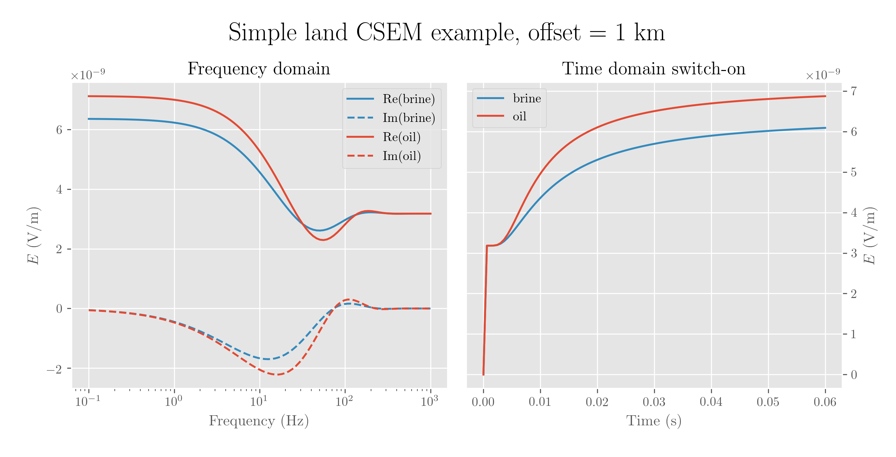
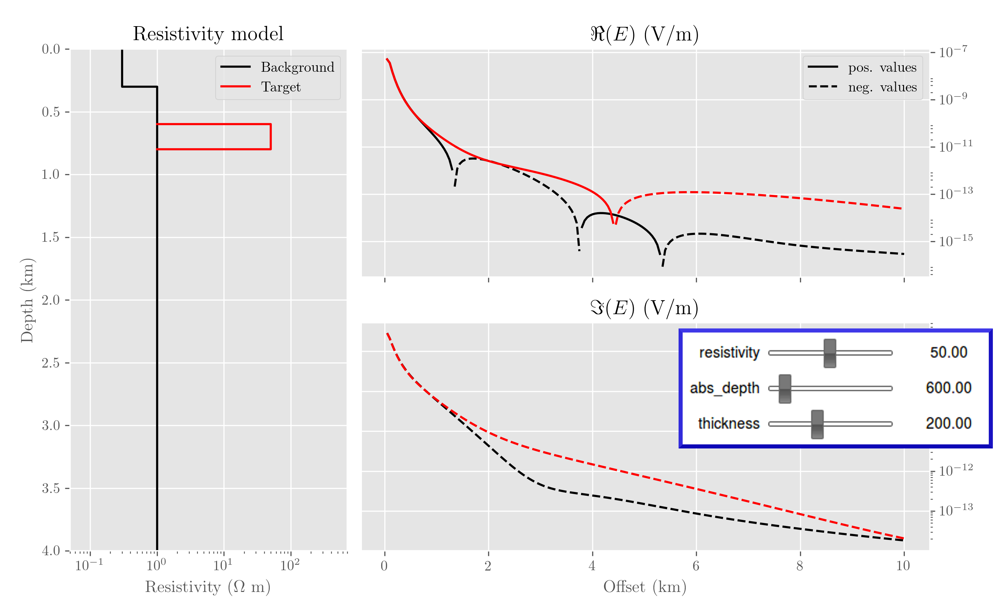
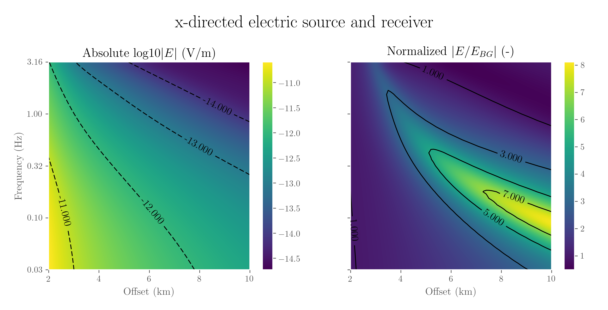

**The Leading Edge - Geophysical Tutorial (TLE April 2017)**

Getting started with electromagnetic modeling
=============================================

Dieter Werthmüller\ :superscript:`1`

This tutorial is about how to get up and running fast and easy with
electromagnetic (EM) modeling, so it specifically targets people who are new to
the subject. And forward modeling is a very important part of understanding EM
responses! The acoustic seismic method has the advantage of the comparatively
easy-to-grasp wave propagation. You can follow in your mind a wave traveling
from the source to an interface, being reflected and traveling back to the
receiver. Just the same way as you can throw a stone into a lake and follow
with your eyes a ripple of the resulting wave. You can even draw on paper
without too much difficulty a idealized seismic receiver-gather of a simple
model. The diffusive behaviour of low frequency EM, such as in
controlled-source EM (CSEM), makes it difficult to imagine the actual
propagation of the signal. An important tool in gaining experience is therefore
forward modeling, and lots of it. The advantage of one-dimensional (1D) forward
modeling is, besides its speed, to study isolated effects (see for instance
[Key_2009]_): What is the influence of resistivity anisotropy, or of fine-scale
resistivity variations?  What is the influence of the airwave? With 1D modeling
you can study these effects fast and isolated, before you go on to more complex
models in higher dimensions. But I hope the examples are also interesting for
readers already familiar with CSEM responses.

Luckily the EM community can count on some stable, high-quality and open-source
modeling codes. The widest distributed and known ones are likely the ones from
the *Marine EM Lab* at Scripps (Steven Constable, Kerry Key and co.):
``DIPOLE1D`` ([Key_2009]_) and ``MARE2DEM`` ([Key_et_al_2011]_) for 1D and 2D
modeling. ``DIPOLE1D`` is an isotropic EM modeler for a stratified model using
the diffusive approximation valid for low frequencies such as used in CSEM
(neglecting displacement currents). More recently, [Hunziker_et_al_2015]_
published ``EMmod``, a 1D electromagnetic modeler including resistivity
anisotropy as well as anisotropic electric permittivity and anisotropic
magnetic permeability, therefore modeling the whole wavefield for electric and
magnetic sources and receivers.

In this tutorial I use the 1D electromagnetic forward modeling code ``empymod``
(Werthmüller 2017, submitted to Geophysics, GEO-2016-0626). The code is
published under a lax permissive open-source license (Apache License V2) and
available at `github.com/prisae/empymod <https://github.com/prisae/empymod>`_.
It is based on [Hunziker_et_al_2015]_ for the wavenumber-domain calculation,
and on [Key_2012]_ for the Hankel and Fourier transforms. From the
documentation of ``empymod`` at `empymod.readthedocs.io
<http://empymod.readthedocs.io>`__: «The electromagnetic python modeller
empymod can model electric or magnetic responses due to a three-dimensional
electric or magnetic source in a layered-earth model with electric vertical
isotropy (:math:`\rho_\text{h}`, :math:`\lambda`), electric permittivity
(:math:`\epsilon_\text{h}`, :math:`\epsilon_\text{v}`), and magnetic
permeability (:math:`\mu_\text{h}`, :math:`\mu_\text{v}`), from very low
frequencies (:math:`f \to` 0 Hz) to very high frequencies (:math:`f \to` GHz).»

There are many ways to get ``empymod``, all of them explained in more details
in the notebook. One of them is with `pip`:

.. code:: bash

    pip install empymod

Minimum requirement is Python 3.4 or higher with ``NumPy`` and ``SciPy``.

The Geophysical Tutorials in this series are often solving a specific problem,
accompanied by a notebook or code where you can execute and reproduce the
example. As this tutorial is specifically about modeling, it is kind of the
other way around: it is a Jupyter Notebook to test and play around, accompanied
by this manuscript for the print version. There is no space here for the
details, and I barely scratch some of the examples I deal with in the notebook.
So I highly encourage you to grab the notebook and get your hands dirty!

A first example
---------------

To start we calculate a simple half-space model:

-  interface at 0 m
-  electric, x-directed source at x=0, y=0, z=0
-  electric receiver at x=1000 m, y=0, z=0, with azimuth = 45° and dip = 10°
-  frequency of 2 Hz

The function ``bipole`` takes up to 24 arguments, but 19 of those have default
values. We only have to provide the five mandatory parameters for this simple
example: sources, receivers, depths, resistivities, and frequencies (in this
order):

.. code:: python

    from empymod import bipole
    bipole([0, 0, 100, 0, 0], [1000, 0, 100, 45, 10], 0, [1, 100], 2)

.. parsed-literal::

    :: empymod END; runtime = 0:00:00.006230 :: 3 kernel call(s)

    array((6.079398324962205e-10-2.8617201015985363e-11j))

As easy as that. We already learn a lot of things from this example. A
dipole is defined as [x, y, z, azimuth, dip], using a left-handed
coordinate system with positive z pointing downwards. The azimuth is the
anti-clockwise deviation from the x-axis, and the dip is the deviation
downwards from the xy-plane.

The default verbosity reveals that ``empymod`` took some milliseconds to
run on my machine, and 3 kernel calls were required. This is because our
receiver has an arbitrary rotation, so it had to calculate the x-, y-, and
z-fields due to an x-directed source. And it returns a complex number, the
result.

Frequency and time domain
-------------------------

We keep it simple in terms of source and receiver: An x-directed source
with x-directed inline receivers for a 4-layer isotropic model (air,
overburden, target, underburden), with and without hydrocarbons, as
presented for instance in [Ziolkowski_et_al_2007]_, figure 2 (model) and
figure 3 (time-domain switch-on result):

.. code:: python

    # Collect common input parameters
    inp2 = {'src': [0, 0, 0.01, 0, 0],
            'rec': [1000, 0, 0.01, 0, 0],
            'depth': [0, 500, 525]}

    # Define resistivities for brine/oil
    bri = [2e14, 20, 20, 20]
    oil = [2e14, 20, 500, 20]

    # 1. Frequency domain
    f = np.logspace(-1, 3, 100)
    fbres = bipole(res=bri, freqtime=f, **inp2)
    fores = bipole(res=oil, freqtime=f, **inp2)

    # 2. Time domain (switch-on)
    t = np.linspace(0, 0.06, 100)
    tbres = bipole(res=bri, freqtime=t, signal=1, **inp2)
    tores = bipole(res=oil, freqtime=t, signal=1, **inp2)

We have to move source and receiver a bit into the lower layer, as
dipoles/bipoles on a layer interface are placed in the upper layer. We have to
provide a signal in order to calculate time-domain results instead of
frequency-domain results: 0=impulse response; 1=switch-on; -1=switch-off.

   Figure 1: Comparison of frequency-domain and time-domain responses for a
   simple model.

There it is, a comparison of frequency-domain and time-domain responses for the
same model. The jump in the time-domain response is the so-called airwave. Now
you see why the frequency-parameter is called ``freqtime``: this parameter
takes frequencies if ``signal = None`` (default) or times if ``signal = {-1, 0,
1}``.

Anisotropy
----------

My personal toy project ever since my M.Sc. thesis is resistivity anisotropy.
Anisotropic CSEM modeling, more specifically vertical transverse isotropic
(VTI) modeling, is the normal case these days (unlike 10 years ago).
Resistivity anisotropy :math:`\lambda` and mean resistivity
:math:`\rho_\text{m}` are commonly defined as

.. math::

   \lambda = \sqrt{\frac{\rho_\text{v}}{\rho_\text{h}}}\ , \qquad \text{and} \qquad \rho_\text{m} = \sqrt{\rho_\text{h}\rho_\text{v}} \ .

The three resistivities :math:`\rho_\text{h}`, :math:`\rho_\text{m}`,
and :math:`\rho_\text{v}` are therefore related through :math:`\lambda`,

.. math::

   \lambda\rho_\text{h} = \rho_\text{m} = \frac{1}{\lambda}\rho_\text{v} \ .

A common mistake is to only speak about *increasing anisotropy*, without
further specification. As can be seen from the above relationship,
*increasing anisotropy* is ambiguous. This is what the 6th example is all
about. The relationship between the three resistivities is elaborated in detail
in [Werthmüller_2009]_. The following figure is a reproduction from
[Hobbs_et_al_2009]_, figure 2:

.. figure:: figures/anisotropy.png
   :width: 100%
   :alt: frequency versus time

   Figure 2: The different effects of resistivity anisotropy depending if
   :math:`\rho_\text{h}`, :math:`\rho_\text{m}`, or :math:`\rho_\text{v}` is
   kept constant.

As can be seen from these results, stating *increasing anisotropy* can mean
quite different things, and it is crucial to specify it more, for instance
«increasing anisotropy by keeping the mean resistivity constant». The isotropic
case, the black line, is the same in all three plots. The conclusions that can
be drawn from the above results are:

1. The initial step, the airwave, depends only on horizontal
   resistivity.
2. The DC value, hence time :math:`t\to\infty`, depends only on the mean
   resistivity.

These insights can be used to calculate apparent anisotropy values of
the subsurface from early and late time CSEM responses ([Werthmüller_2009]_).

Interactive modeling
--------------------

Jupyter and the ``ipywidgets`` make it incredibly easy to create interactive
plots, which I use in the notebook to create an interactive model for
``empymod``. All there is to do is to load the widgets, define the desired
sliders, create a plot function as we have done for the examples before, and
subsequently call ``interact``. In the example I include three sliders, one
for the resistivity of the target layer, one for the depth of the target layer,
and one for the thickness of the target layer. The following five lines are all
that is required to generate an interactive modeler. They import the required
functions, define the three sliders, and finally activate the interaction:

.. code:: python

    from ipywidgets import FloatSlider, interact
    w_res = FloatSlider(min=0.1, max=100.0, step=0.1,
                        value=50, continuous_update=False)
    w_thi = FloatSlider(min=10, max=500, step=10, value=200,
                        continuous_update=False)
    w_dep = FloatSlider(min=350, max=3000, step=50, value=600,
                        continuous_update=False)
    fwgt = interact(calc_em, resistivity=w_res,
                    abs_depth=w_dep, thickness=w_thi)

   Figure 4: A simple, interactive CSEM modeler. (The sliders are not actually
   above the figure, but in the next notebook-cell.)

This interactive example should give you a good idea how to write your own
interactive modeler. With a few changes you could instead have a slider for
frequencies, anisotropies, source/receiver azimuth and dip, or any other
parameter that goes into ``bipole``.

More examples
-------------

The notebook contains, besides much more details, the following four
additional examples:

1. Comparison bipole versus dipole;
2. Calculate the amplitude and phase of the entire xy-plane;
3. Calculate offset versus frequency crossplot, a common tool for feasibility
   studies;
4. Common-source gather of time-domain responses.

   Figure 4: Offset versus frequency crossplots: left the amplitude, right
   the normalized response. The figure shows that for this particular model the
   best target response are for offsets greater than roughly 5 kilometers in
   the frequency range between 0.05 - 0.3 Hz, with magnitudes in the order of
   -12 to -13.

.. figure:: figures/commonsourcegather.png
   :width: 100%
   :alt: frequency versus time

   Figure 5: A common-source gather of time-domain CSEM responses for a simple
   1D model, a display that might appeal more to readers coming from seismic
   data (for instance [Ziolkowski_et_al_2011]_, figures 9 and 10).

The eight complete examples in the notebook should get you up and running with
CSEM modeling. *If you are interested in this please get involved!  I am open
for suggestions and pull requests, thankful for bug reports, and happy if I see
that you fork it and create something awesome of your own.*

Happy EM modeling!

Corresponding author: dieter@werthmuller.org

:superscript:`1` Consultant, Mexico City

References
----------

.. |_| unicode:: 0xA0
   :trim:

.. [Hobbs_et_al_2009] Hobbs, B. A., D. Werthmüller, and F. Engelmark, 2009,
   Apparent  anisotropy derived from transient electromagnetic earth responses:
   SEG Technical Program Expanded Abstracts, 744-748;
   DOI: |_| `10.1190/1.3255861 <http://dx.doi.org/10.1190/1.3255861>`_.
.. [Hunziker_et_al_2015] Hunziker, J., J. Thorbecke, and E. Slob, 2015, The
   electromagnetic response in a layered vertical transverse isotropic medium:
   A new look at an old problem: Geophysics, 80, F1--F18;
   DOI: |_| `10.1190/geo2013-0411.1
   <http://dx.doi.org/10.1190/geo2013-0411.1>`_;
   Software: |_| `software.seg.org/2015/0001
   <http://software.seg.org/2015/0001>`_.
.. [Key_2009] Key, K., 2009, 1D inversion of multicomponent, multifrequency
   marine CSEM data: Methodology and synthetic studies for resolving thin
   resistive layers: Geophysics, 74, F9--F20;
   DOI: |_| `10.1190/1.3058434 <http://dx.doi.org/10.1190/1.3058434>`_;
   Software: |_| `marineemlab.ucsd.edu/Projects/Occam/1DCSEM
   <http://marineemlab.ucsd.edu/Projects/Occam/1DCSEM>`_.
.. [Key_et_al_2011] Key, K., and J. Ovall, 2011, A parallel goal-oriented
   adaptive finite element method for 2.5-D electromagnetic modelling:
   Geophysical Journal International, 186, 137-154;
   DOI: |_| `10.1111/j.1365-246X.2011.05025.x
   <http://dx.doi.org/10.1111/j.1365-246X.2011.05025.x>`_;
   Software: |_| `mare2dem.ucsd.edu <http://mare2dem.ucsd.edu>`_.
.. [Key_2012] Key, K., 2012, Is the fast Hankel transform faster than
   quadrature?: Geophysics, 77, F21--F30;
   DOI: |_| `10.1190/GEO2011-0237.1
   <http://dx.doi.org/10.1190/GEO2011-0237.1>`_;
   Software: |_| `software.seg.org/2012/0003
   <http://software.seg.org/2012/0003>`_.
.. [Werthmüller_2009] Werthmüller, D., 2009, Inversion of Multi-Transient EM
   data from anisotropic media: M.Sc. Thesis;
   UUID: |_| `f4b071c1-8e55-4ec5-86c6-a2d54c3eda5a
   <http://repository.tudelft.nl/view/ir/uuid:f4b071c1-8e55-4ec5-86c6-a2d54c3eda5a>`_.
.. [Ziolkowski_et_al_2007] Ziolkowski, A., B. A. Hobbs, and D. Wright, 2007,
   Multitransient electromagnetic demonstration survey in France: Geophysics,
   72, F197-F209;
   DOI: |_| `10.1190/1.2735802 <http://dx.doi.org/10.1190/1.2735802>`_.
.. [Ziolkowski_et_al_2011] Ziolkowski, A., D. Wright, and J. Mattsson, 2011,
   Comparison of pseudo-random binary sequence and square-wave transient
   controlled-source electromagnetic data over the Peon gas discovery, Norway:
   Geophysical Prospecting, 59, 1114-1131;
   DOI: |_| `10.1111/j.1365-2478.2011.01006.x
   <http://dx.doi.org/10.1111/j.1365-2478.2011.01006.x>`_.
